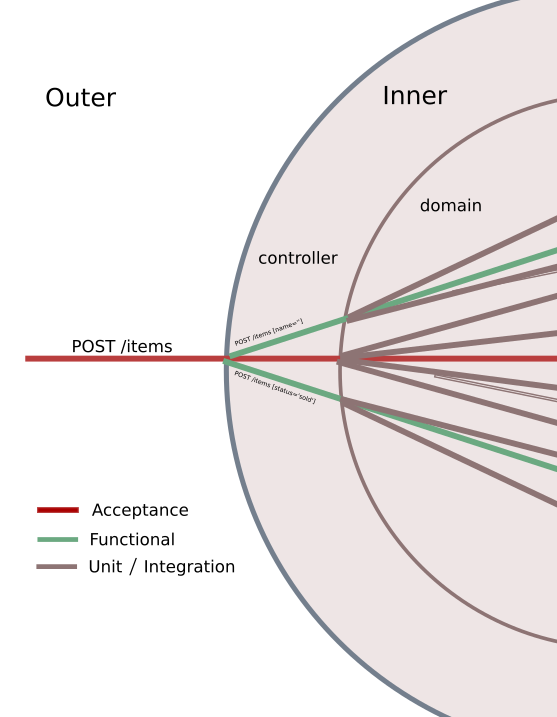
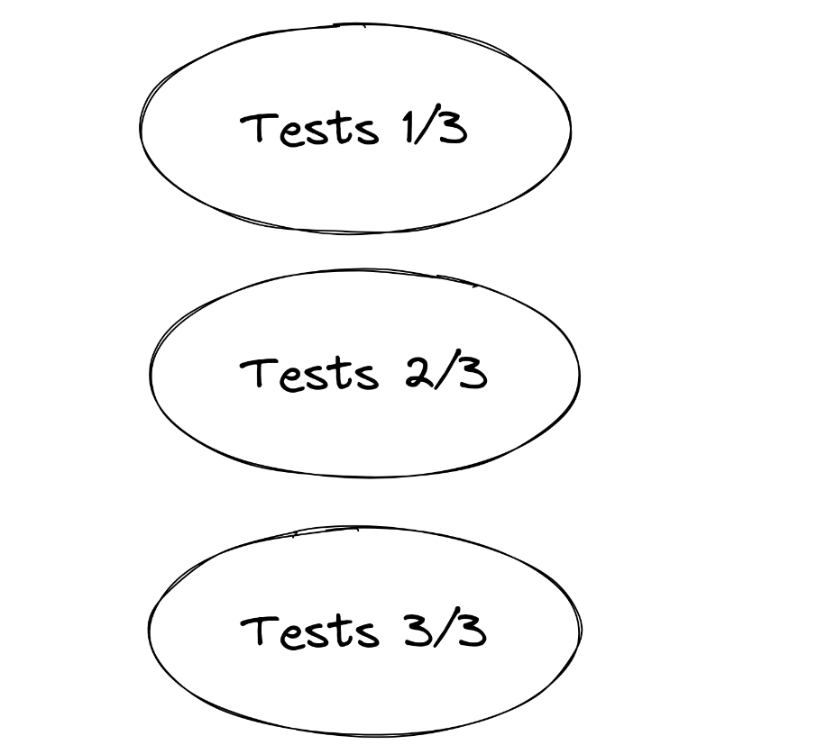
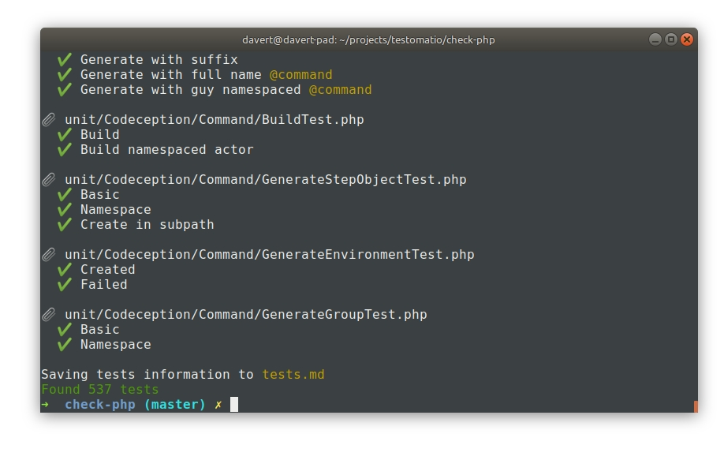
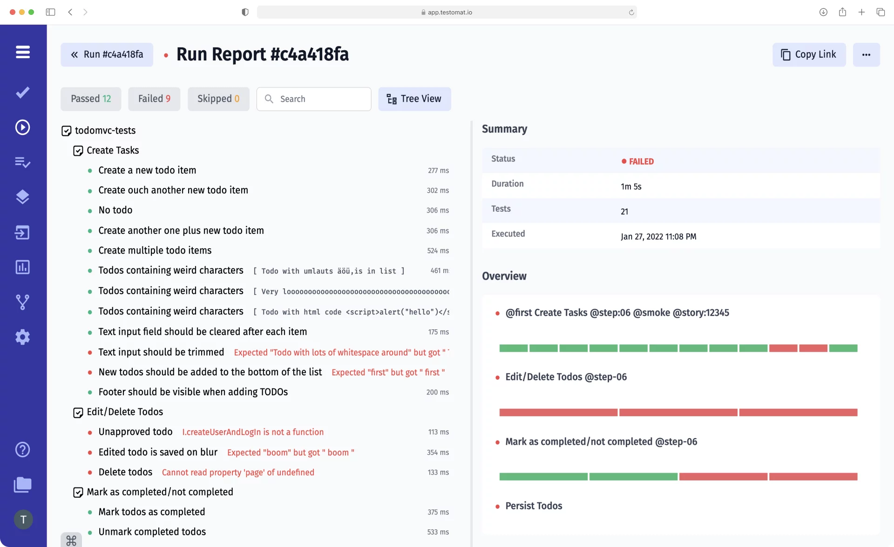

<style>
h1, h2, h3, h4, h5, p, ul {
  font-family: 'Comfortaa', sans-serif;
}
h1, h2, h3, h4, h5 {
  font-weight: 700;
}
</style>

# Правильні підходи до тестування в PHP: Або як кількість може зламати якість

Михайло Боднарчук @davert

2024

---

## Про мене

* Створив Codeception (PHP Testing Framework) в 2011 році
* Працював як PHP Testing Consultant
* В 2020 запустив свій стартап Testomat.io
* Пишу на Ruby та JS 😅

---

## Доповіді на PHP конференціях

|     |     |
|-----------------|------------------|
| США (Longhorn PHP, PHPTech)            | Нідерланди (DutchPHP)       |
| Бельгія (PHP Benelux)         |      Іспанія (Joomla Days)        |
| Естонія (Nordic Testing Days)         | Польша (PHPEU)           |
| Шотландія (Scotland PHP)       | Німеччина        |
| Франція (PHP Tour)         | Болгарія (Bulgaria PHP)         |
| Сербія (PHP Serbia)          | Турція (PHPKonf)           |

---


## Як я був PHP Testing консультантом

> Консультантів наймають як чарівників...

---

## Що я зрозумів

* Консультанти не чарівники (а деякі ще й шарлатани)
* Консультанти необхідні для форсування змін

---

## Нащо ми пишемо тести

* Щоб не боятись міняти код
* Щоб розуміти що відбувається в проекті
* Щоб зменшити необхідність ручного тестування
* Щоб не отримувати баги в продакшні

---


---

## Отож...

* 100500 мільйонів тестів
* час виконання: теплова смерть всесвіту + 2 год
* всі розробники які їх писали померли від старості
* 666 failed tests і кожен раз різні

---

## 🚩 Red Flags

* відсутня архітектура тестів
  👉 пишуть різні команди незалежно
  👉 запускаємо браузер де можна було б додати юніт-тест

* кастомний раннер тестів
  👉 застрягли на старій версії фреймворка

* відсутність тест рев'ю
  👉 мертвий код
  
---

## Архітектура




---

## Рівні Тестування

* Зовнішній
  * Браузер
  * API
* Внутрішній
  * HTTP Controller
  * Module
  * Service
  * Class
---

## Загальні поради

* Розробники мають взаємодіяти з тестувальниками
* Переносити деталізацію на внутрішній рівень
* Зміни краще робити поступово (по бандлам, по модулям)
* Тести розбивати на групи, щоб вони не йшли по 100 год

---

## Як прискорити роботу тестів

* Провести Performance Review
  👉 Визначити які кроки ідуть найдовше
* Оптимізувати інфраструктуру
  👉 Мінімізувати час запуску застосунку
  👉 Мати docker image застосунку з даними
* Паралелізація тестів
* Використовувати сучасні технології

---

# Паралелізація

* Паралелізація тестів в PHP
  * ~~paratest~~
  * ~~robo-paracept~~
  * ~~pest --parallel~~
* В PHP нема паралелізації 🤷

---

> 😇 Не витрачайте час: налаштуйте паралелізаціюю через CI

> 🥵 Локальна паралелізація нічого не дає

---

# Основні проблеми паралелізації

* Масштабування
* Запуск CI джобів
* Консистентність даних
* Аналіз результатів

---

## Sharding

Найпростіша паралелізація на CI

```
php vendor/bin/codecept run --shard 1/3
php vendor/bin/codecept run --shard 2/3
php vendor/bin/codecept run --shard 3/3
```



---

## Сучасні технології

Browser Testing:

* Playwright (~3x швидкості) 👉 NodeJS, Python
* Puppeteer 👉 NodeJS
* CodeceptJS (+Playwright) 👉 NodeJS
* WebDriver Bidi 👉 Java, NodeJS, ...
* ~~Cypress.io~~

---

## Не пишіть свій тестовий фреймворк

* Він не вирішує жодної бізнес-задачі
* Відсутність документації
* Навчання нових людей
* Нема сторонніх інтеграцій

---

## Testing Frameworks

* PHPUnit
* Codeception
* Behat
* Pest
* ...+ JS Testing Frameworks!

---

## Рев'ю Тестів

* Зберігайте репорти по запускам
* Прикрутіть аналітику до тестів
  * Які тести нестабільні
  * Які найповільніші
  * ...
* Регулярний огляд тестів по фічам
  * Прив'яжіть тести до Jira

---

## Як швидко переглянути всі тести 

```
composer require testomatio/list-tests --dev
php vendor/bin/list-tests test/
```



---

# Чи все протестовано?

---


---

# Ручне тестування

* досвід реальних користувачів
  * UX дефекти
  * повільна робота
* пошук нестандартних способів взаємодії
  * а чим можна клікнути сюди?
  * а що буде якщо ....

---

# Як керувати купою тестів і жити життя

* Зробити тести видимими
* Мати архітектуру тестів
* Використовувати сучасні технології
* По максимуму оптимізовувати CI

---



---

## Testomat.io

> Ми робимо тести видимими

* SaaS де можуть бути всі ваші тести
* Поєднання ручних і автоматичних тестів
* Прив'язка до Jira Issues
* Репорти та аналітика
* Агрегація репортів при шардінгу
* Підтримується PHPUnit, Codeception, ... 

---

## 👐 Дякую за увагу!

**Михайло Боднарчук @davert**

Мої проекти:

* codeception.com
* codecept.io
* **testomat.io**

Контакти:

* Твіттер, Телеграм: @davert